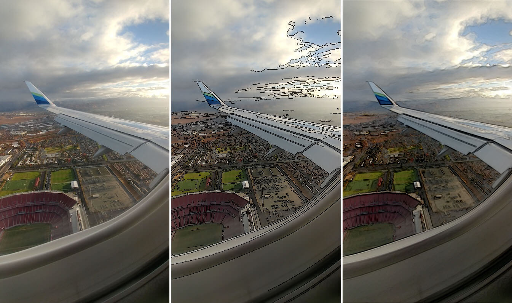
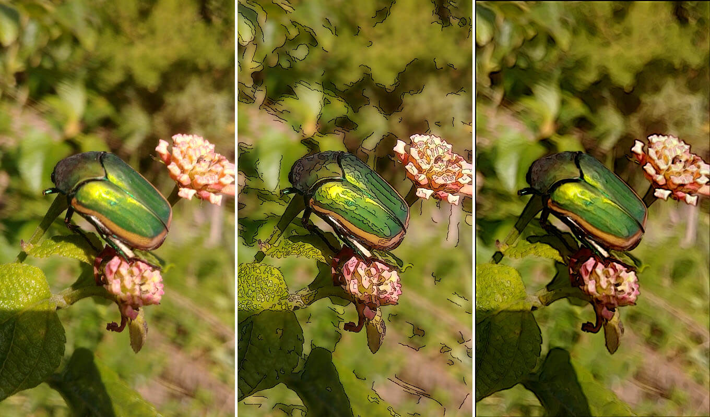
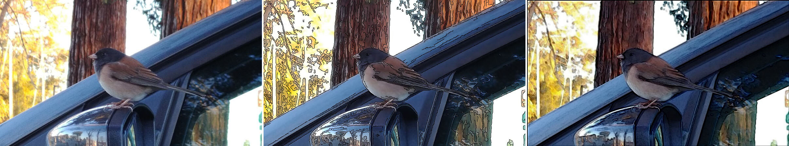

# Gradient Domain Processing
Image blending and NPR (non-photorealistic rendering).





## Usage
### Image Blending
```
python3 blend.py <path to source> <path to target> [-mg]
```

### NPR
```
python3 npr.py <path to image> [-gm]
```

## Reference
[Spec from Berkeley's comp. photo class](https://inst.eecs.berkeley.edu/~cs194-26/fa16/hw/proj4g-gradient/index.html)  
[Poisson Image Editing by Pérez et al.](http://cs.brown.edu/courses/csci1950-g/asgn/proj2/resources/PoissonImageEditing.pdf)  
[GradientShop optimization framework](http://grail.cs.washington.edu/projects/gradientshop/demos/gs_paper_TOG_2009.pdf)
